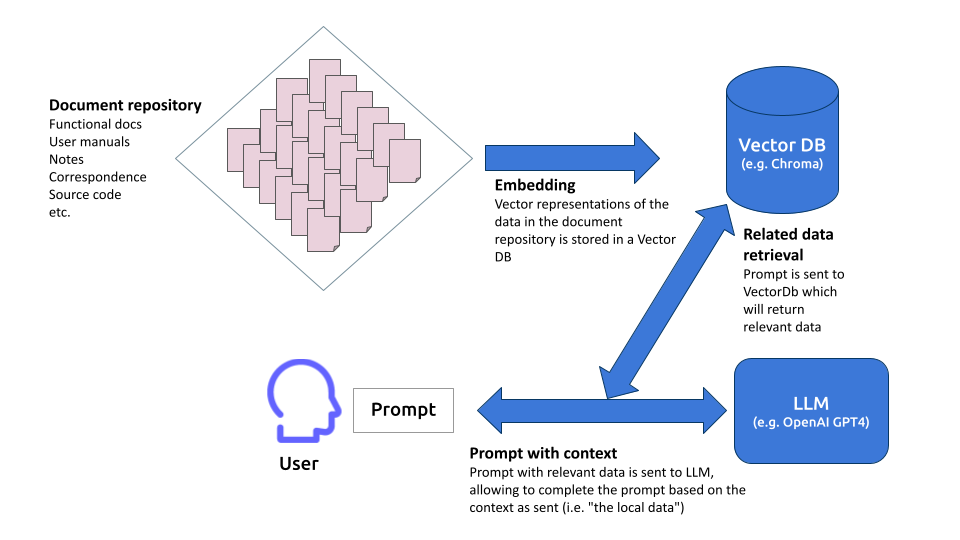
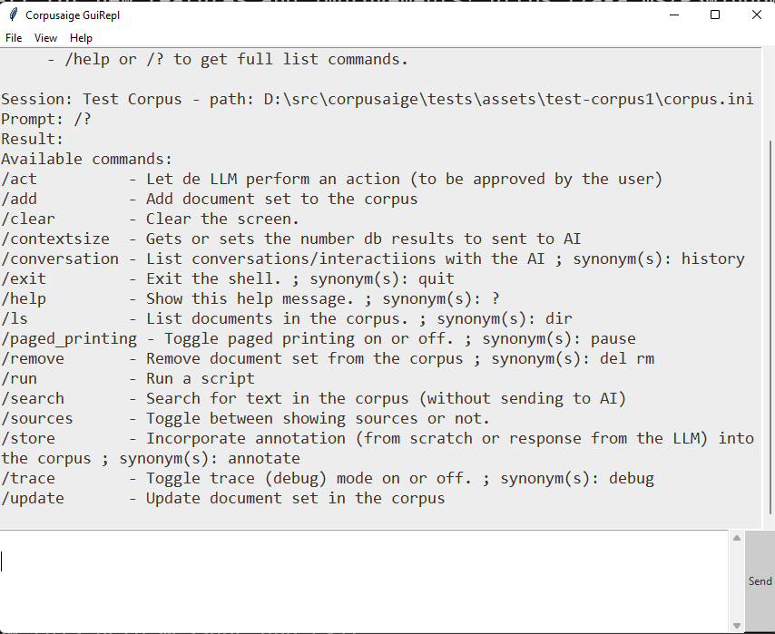

# Corpusaige
_Corpusaige_ is a Python tool (and utility library) for “Retrieval Augmented Generation”: AI-assisted analysis and comprehension of document sets and source code 

## Introduction
Corpusaige provides a powerful capability for system analysts and developers, aiding in the aggregation of an expansive collection of related document sets and complex source code pertinent to a specific system or domain. By bridging the gap between this collective information (termed the Corpus) and AI Large Language Models (LLMs), Corpusaige facilitates an insightful, AI-aided analysis, granting an holistic view of the project or system at hand.


## How does it work
The tool works by:

 - Aggregate documentation and source code into a searchable (vector) database.
 - Interact with AI (e.g., GPT-4) for insights on the system (using searches of the database)
 - Continuous updates enhance AI's accuracy.

This tool/library embodies therefore an iterative approach to knowledge refinement. It enables users to supplement the Corpus with additional metadata, introduce new information, and incorporate the AI's analysis results back into the system. This iterative enhancement to the Corpus significantly increases the precision and depth of the system's understanding, fostering a dynamic, ever-evolving model that encapsulates all relevant system or domain information.

For a good backgrounder on "Retrieval Augmented Generation" (RAG) which forms the basis underlying Corpusaige, see this article: [Harnessing Retrieval Augmented Generation With Langchain](https://betterprogramming.pub/harnessing-retrieval-augmented-generation-with-langchain-2eae65926e82)



## Installation

For the moment Corpusaige is not available as a distributable. It needs to be installed from source. 

It works with Python 3.11 on any modern Linux distribution. On Windows it has only been tested using Python and dependencies installed with [Scoop](https://scoop.sh/).

Use git to clone the repository. Use the dependency and package manager [Poetry](https://python-poetry.org/) to install all the dependencies.

```bash
❯ poetry install
```
### Usage of the virtual environment
[Activate the Python virtual environment](https://python-poetry.org/docs/basic-usage/#activating-the-virtual-environment) with

```bash
❯ poetry shell
```
### Run the applicacion

You can run the application by starting Corpusaige as a module. 

```bash
❯ python -m corpusaige
```
The binary distribution will have a script allowing running the app with a single command ("crpsg", see the examples down). In order to use this in the development environment you have to incorporate the utility in the path. This can be done with the following script

On Windows
```bash
❯ setpath.ps1
```
On Linux
```bash
❯ source setpath.sh
```
### Running tests

Corpusaige uses [Pytest](https://docs.pytest.org/) as its primary testing infrastructure. This is installed automatically as part of the dependencies of the project. The tests can be executed by running pytest in the root of the Corpusaige directory:

```bash
❯ pytest
```
## Usage

## Command line
```bash
❯ crpsg --help
python -m corpusaige --help
#or
❯ crpsg --help

usage: crpsg (or python -m corpusaige) [-h] [-p PATH] [-v] {new,add,remove,shell,gui,prompt} ...

Corpusaige command line interface

positional arguments:
  {new,add,remove,shell,gui,prompt}
    new                 Create a new corpus
    add                 Add a document set (i.e. files) to a corpus
    remove              Remove a document set (i.e. files) from a corpus
    shell               Display the Corpusaige Shell (console)
    gui                 Display the Corpusaige Gui
    prompt              Send prompt (not repl command) to corpus/AI.

options:
  -h, --help            show this help message and exit
  -p PATH, --path PATH  Path to corpus (default: current dir)
  -v, --version         show program's version number and exit

```

What follows are more detailed explanations of the commands "new" and "add" with the purpose to get started quickly:

### A new Corpus

First, create a new Corpus with the following options

```bash
crpsg -p {path} new {name}

❯ crpsg -p /home/soyrochus/data new gutenberg 
```
This will create a new Corpus with the name "gutenberg". The Corpus is basically a file with the name corpus.ini and a number of other files in the aforementioned directory. 

In case the -p option is omited, the current directory will be used to create the corpus subdirectory. 

### Adding documents to the Corpus

A Corpus can contain multiple document sets. These are collections of documents grouped under the same name to 

```bash

crpsg -p {path corpus} add -n {name} -p {path directory with documents} -t {document type(s)} [-r] #(recursive or not)
❯ crpsg -p gutenberg add -n "Philosophy" -p /home/soyrochus/tmp/gutenberg/Philo_txt -t text:{txt:md} -r
```
In this example the _Philosophy_ document set will consist of all text files with the *.txt and *.md (mark-down) files contained in the mentioned directory and all of its subdirectories, due to the -r (recursive) option.

## Usage of the shell and Gui

The shell and Gui are based on a multi-line prompt which is immediately available to have a conversation (to "chat") with the configured LLM. Use Alt+Enter or Alt-Enter to send the prompt. 

Instead of sending a prompt you can give a command. All commands start with the character "/". For example, use command /exit to quit the shell and use /help or /? to get full list commands.

```bash
Welcome to the Corpusaige shell

Use: - Alt+Enter or Alt-Enter to send command or prompt.
     - the Up and Down keys for command history
     - /exit or /quit to quit the shell.
     - /help or /? to get full list commands.
Use TAB to autocomplete commands.

Session: Test Corpus - path: D:\src\corpusaige\tests\assets\test-corpus1\corpus.ini
> /?
Available commands:
/act          - Let de LLM perform an action (to be approved by the user)
/add          - Add document set to the corpus
/clear        - Clear the screen.
/contextsize  - Gets or sets the number db results to sent to AI
/conversation - List conversations/interactiions with the AI ; synonym(s): history
/exit         - Exit the shell. ; synonym(s): quit
/help         - Show this help message. ; synonym(s): ?
/ls           - List documents in the corpus. ; synonym(s): dir
/paged_printing - Toggle paged printing on or off. ; synonym(s): pause
/remove       - Remove document set from the corpus ; synonym(s): del rm
/run          - Run a script
/search       - Search for text in the corpus (without sending to AI)
/sources      - Toggle between showing sources or not.
/store        - Incorporate annotation (from scratch or response from the LLM) into the corpus ; synonym(s): annotate
/trace        - Toggle trace (debug) mode on or off. ; synonym(s): debug
/update       - Update document set in the corpus
>

```



## Used as a library

```python
from corpusaige.corpus import StatefullCorpus

corpus = StatefullCorpus("../test-case/test-book") # initiate new Corpus
print(f'Using Corpus: "{corpus.name}" at {corpus.path.resolve()}')
# prints: Using Corpus: "Rust book(s)" at /home/iwk/src/corpusaige/test-case/test-book/corpus.ini

result = corpus.send_prompt("What is a trait in Rust?")

"""
result contains: 'A trait in Rust is a language construct that defines a set of methods that can be implemented by types in the language. Traits are used to provide shared behavior between different types and can also be used to define type relationships.'
"""

```
## Dependencies
### Langchain
Langchain is chosen as our main framework for Corpusaige because of its robustness in natural language processing and its compatibility with various language model APIs, aligning with our requirements.

### OpenAI Models
We leverage OpenAI's advanced language models, such as GPT-4, GPT-3.5 and Codex, for their superior language understanding and generation capabilities.

For our initial release, these technologies form the core. However, we recognize the dynamic nature of AI and are open to integrating other emerging models in future versions of Corpusaige, ensuring the tool remains relevant and effective.

### ChromaDb
ChromaDb is integrated for its efficient vector data storage capabilities, crucial in handling the high-dimensional vector representations of our processed documents. It aids in both local and cloud-based data storage, providing scalability and facilitating smooth interaction with the AI models.


### Contributing

Pull requests are welcome. For major changes, please open an issue first to discuss what you would like to change.

Please make sure to update tests as appropriate.

## Copyright and licence

Copyright © 2023 Iwan van der Kleijn

Licensed under the MIT License 
[MIT](https://choosealicense.com/licenses/mit/)


